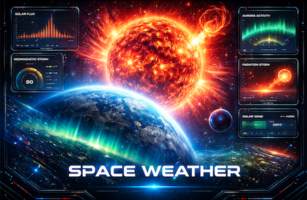

# OpenC3 COSMOS Space Weather Plugin

<p align="center">
  
</p>

An OpenC3 COSMOS plugin that provides real-time space weather monitoring using NOAA Space Weather Prediction Center (SWPC) APIs.

## Features

- **NOAA Space Weather Scales** — Displays current R (Radio Blackout), S (Solar Radiation), and G (Geomagnetic Storm) scale levels with color-coded severity (0-5)
- **3-Day Forecast** — Probability percentages for radio blackouts and solar radiation storms, plus predicted geomagnetic storm levels
- **Latest Alert** — Collapsible panel showing the most recent NOAA space weather alert message
- **Info Tooltips** — Plain-English explanations of each scale and forecast value for non-experts
- **Refresh on Demand** — Manual refresh button to fetch the latest data immediately
- **Timezone Aware** — Respects the user's OpenC3 timezone setting

## Data Sources

- [NOAA SWPC Space Weather Scales](https://services.swpc.noaa.gov/products/noaa-scales.json) — Current conditions and 3-day forecast
- [NOAA SWPC Alerts](https://services.swpc.noaa.gov/products/alerts.json) — Space weather alerts, watches, and warnings

## Configuration

| Variable | Default | Description |
|----------|---------|-------------|
| `spaceweather_target_name` | `SPACEWEATHER` | Target name |
| `hostname` | `services.swpc.noaa.gov` | NOAA SWPC API hostname |
| `protocol` | `https` | API protocol |
| `port` | `443` | API port |
| `poll_period` | `3600` | Polling interval in seconds (0 to disable) |

## Building

```bash
rake build VERSION=1.0.0
```
